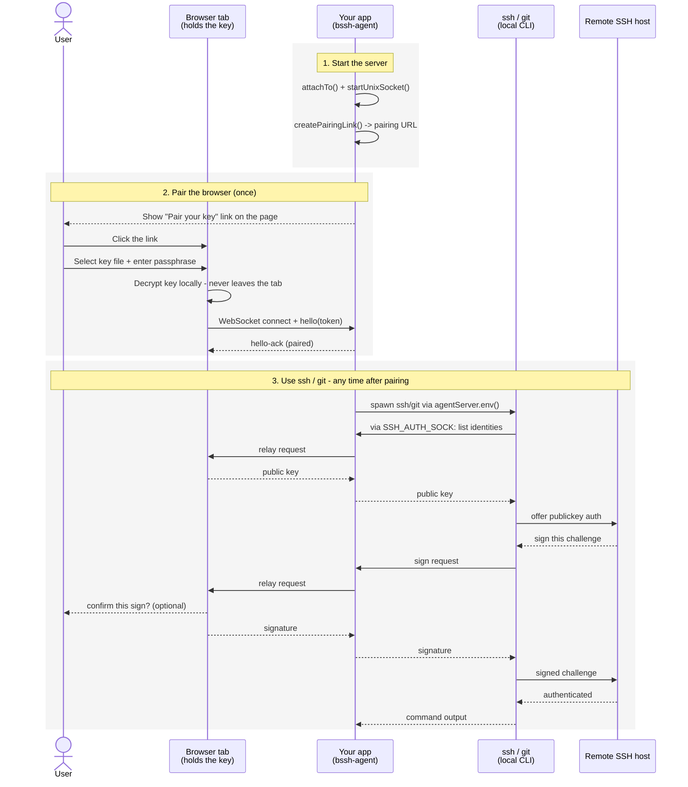

# browser-ssh-agent

*[English](./README.md)*

WebSocket 経由で SSH エージェントフォワーディングを実現するライブラリです。秘密鍵はブラウザタブの中だけに存在し、署名処理は Node.js 側の SSH クライアントへ WebSocket 経由で中継されます。`ssh -A` の「エージェント」役を、ローカルのソケットではなく**ペアリングされたブラウザセッション**が担う、と考えると分かりやすいです。

## 仕組み

ペアリング（下記のステップ2）は一度行えば十分です。それ以降は、ブラウザタブが接続されている限り、追加の設定なしにステップ3の `ssh` / `git` の利用を何度でも繰り返せます。



## できること

本ライブラリの中核機能は、ペアリング済みのブラウザセッションへ届いた署名リクエストを、本物の `SSH_AUTH_SOCK` Unix ドメインソケット（`agentServer.startUnixSocket()`）へ中継することです。`agentServer.env()` を `child_process.spawn()` の呼び出しに展開すれば、その子プロセスとして起動された `ssh` / `git` / `rsync` / `scp` は、サーバー上にもディスク上にも一切存在せず、ブラウザタブの中だけに存在する鍵を使って認証できます。

この上に、さらに2つの機能が積み重なっています。

- **`bssh-agent` CLI** — `agentServer.env()` ではカバーできないケース、つまり Node アプリが起動した子プロセスではなく、人間が自分のシェルへ直接 `ssh` / `git` / `rsync` と入力するケースのための、`ssh-agent` 形式のスタンドアロンデーモンです。詳しくは [CLI: ターミナル用の `SSH_AUTH_SOCK`](#cli-ターミナル用の-ssh_auth_sock) を参照してください。
- **`<bssh-agent-pairing>` ウィジェット**（`bssh-agent/widget`） — 下記のブラウザ側プリミティブをラップしたドロップイン Web Component です。ホストページ側で鍵入力フォームや署名確認ダイアログを自前で書く必要がなく、`<script>` タグとカスタムエレメントを置くだけで済みます。詳しくは [ブラウザ側, ドロップインウィジェットを使う](#ブラウザ側-ドロップインウィジェットを使う) を参照してください。

v1 では Ed25519 鍵のみサポートしています。RSA / ECDSA は `Signer` インターフェース（`src/browser/signers/`）を実装することで追加できます — プロトコルの変更は不要です。

外部 CLI ツールを起動する代わりに、`ssh2` 自身の `Client` API と直接統合する、より低レベルな方法もあります — [高度な使い方](#高度な使い方) を参照してください。

## インストール

```sh
npm install bssh-agent
```

このパッケージは **ESM 専用**です（`import` のみで `require()` は使えません）。4つのサブパスエクスポートを公開しています。

- `bssh-agent/server` — Node.js 側のサーバー API（`AgentServer` など）。
- `bssh-agent/browser` — ブラウザ側のプリミティブ（`loadKeyFromFile`、`connectAgent` など）。
- `bssh-agent/widget` — 上記の `bssh-agent/browser` の上に構築された、ドロップインの `<bssh-agent-pairing>` Web Component。
- `bssh-agent/shared` — 上記3つすべてで共有されるプロトコル型定義。

`bssh-agent` という CLI バイナリもインストールされます — `npx bssh-agent` で実行するか、パッケージインストール後であれば単に `bssh-agent` と入力するだけで実行できます。

すべてのサブパスにわたるエクスポート・オプション・イベントの網羅的な一覧は、[APIリファレンス](./docs/REFERENCE.ja.md) を参照してください。

## 使い方

### サーバー側

アプリの既存の HTTP(S) サーバーにアタッチし、Unix ソケットトランスポートを起動します — これが `AgentServer` を組み込む標準的な方法です。

```ts
import { createServer } from 'node:http';
import { spawn } from 'node:child_process';
import { AgentServer } from 'bssh-agent/server';

const httpServer = createServer(/* アプリ側の既存のリクエストハンドラ */);
const agentServer = new AgentServer();

agentServer.attachTo(httpServer, '/ws');
await agentServer.startUnixSocket();

// このURLは、ユーザーが既に自分のブラウザで見ているページ上にリンクやボタンとして
// 描画します（例: `<a href={url}>SSH鍵をペアリングする</a>`）— 他の経路で
// 中継する必要はありません。永続的なログには残さないこと —
// ペアリングトークンはあえてフラグメントに載せています。
const { url } = agentServer.createPairingLink('https://your-app.example/pair');

agentServer.on('session-paired', () => {
  spawn('git', ['clone', 'git@github.com:you/repo.git'], {
    env: { ...process.env, ...agentServer.env() },
    stdio: 'inherit',
  });
});

// これはアプリ自身のサーバー起動処理であり、本ライブラリの一部ではありません。
// attachTo() は 'upgrade' イベントリスナーを登録するだけで、それ自体はリッスンを開始しません。
httpServer.listen(8787);
```

上記の `/ws` パスは `<bssh-agent-pairing>` のゼロコンフィグ既定値と一致しています — 詳しくは下記のウィジェットの節を参照してください。`agentServer.listen(port)` も `attachTo()` の代わりにスタンドアロンで使える手段として用意されています。詳しくは [APIリファレンス](./docs/REFERENCE.ja.md#bssh-agentserver) を参照してください。

### ブラウザ側

`createPairingLink` の `baseUrl` が指すページから配信されます。

```ts
import { loadKeyFromFile, connectAgent } from 'bssh-agent/browser';

const token = new URLSearchParams(location.hash.slice(1)).get('token')!;
const key = await loadKeyFromFile(fileInput.files[0], passphraseInput.value);

const connection = connectAgent({
  wsUrl: 'wss://your-app.example:8787/ws',
  token,
  key,
  confirmSign: async ({ comment, fingerprint }) =>
    confirm(`${comment}（${fingerprint}）で署名しますか？`),
});
```

### ブラウザ側, ドロップインウィジェットを使う

`<bssh-agent-pairing>` は上記の `loadKeyFromText` + `connectAgent` を、鍵読み込みフォームと署名確認 UI を備えた単一のカスタムエレメントにラップしたものです — `<script>` タグとこのタグ自体を置くだけで、フォームやダイアログを自前で書く必要はありません。

```html
<script type="module" src="https://unpkg.com/bssh-agent@0.1.0/dist/widget/index.js"></script>
<bssh-agent-pairing></bssh-agent-pairing>
```

`@latest` を使わずバージョンを固定してください（上記のように） — 後のリリースでの破壊的変更によって、コピー＆ペーストした `<script>` タグの読み込み先が黙って変わってしまうべきではないからです。自分のアプリの静的アセットとして `dist/widget/index.js` をセルフホストする方法も同様に機能し、サードパーティ CDN への実行時依存を避けられます。

既定では、`location.hash` からペアリングトークンを読み取り（`createPairingLink()` の出力と一致）、`${location.protocol}://${location.host}/ws` から WebSocket URL を導出します — これは上記の `attachTo(httpServer, '/ws')` の例と一致しています。ホストページが明示的にこれらを指定する必要がある場合（別のパスを使う場合や、iframe に埋め込む場合など）は、`ws-url` 属性を渡すか、JS から `token` / `wsUrl` プロパティを設定してください。

`status-change`、`paired`、`error`、`sign-request`、`key-forgotten` の各 `CustomEvent` を発火するため、ホストページは `bssh-agent/browser` に直接触れることなく動作を監視できます。

```js
document.querySelector('bssh-agent-pairing').addEventListener('paired', () => {
  console.log('key paired and ready');
});
```

切断時（および組み込みの「Forget key」ボタン経由）には*復号済みの*鍵を自動的にゼロ化します — 詳しくは[セキュリティに関する注意](#セキュリティに関する注意)を参照してください — そのため、切断後は必ずパスフレーズの再入力が必要になります。一方で再入力が*不要*なのはファイルの方です。ウィジェットは暗号化されたままのキーファイルのテキストをページが生きている間メモリ上にキャッシュしておくため、WebSocket の切断後（ネットワークの瞬断、PC のスリープ、タブがバックグラウンドになった場合など — タブを実際に閉じたりページをリロードしたりしない限り）の再接続では、ファイル選択フォーム全体ではなくパスフレーズのみの入力フォームが表示されます。「Use a different file」ボタンは常に併設されており、このキャッシュを破棄して再度ファイル選択に戻ることができます。また明示的な「Forget key」ボタンは、復号済みの鍵*と*キャッシュされたファイルの両方を必ず消去します — パスフレーズなしで再接続する方法はなく、あるのはファイルの再選択を避ける方法だけです。暗号化されたテキストをキャッシュすること自体はセキュリティ上のコストがありません。これはまさにパスフレーズがすでに保護している対象そのものであり、パスフレーズ自体は決してキャッシュされません。再接続には、それでもホストアプリから発行された新しいペアリングトークンが必要です（トークンはワンタイムであり、セッションの再開機構はありません）— スキップされるのは鍵読み込みのステップだけです。

組み込みの承認/拒否プロンプトを完全にスキップするには `auto-confirm="true"` を設定してください（使用時はコンソールに警告が出力されます — 下記のセキュリティに関する注意を参照）。または `confirmSign` プロパティを設定して、組み込みのものの代わりに独自の UI を指定することもできます。

属性・プロパティ・イベントの完全な一覧は [APIリファレンス](./docs/REFERENCE.ja.md#bssh-agentwidget) を参照してください。

## CLI: ターミナル用の `SSH_AUTH_SOCK`

`agentServer.env()` は、自分の Node プロセスが行う `child_process.spawn()` の呼び出しにしか役立ちません。人間が自分のすでに動いているシェルへ直接 `ssh` / `git` / `rsync` と入力するケースには何の役にも立ちません — Unix には、後から兄弟プロセスへ環境変数を注入する方法がないからです。`bssh-agent` CLI は、本物の `ssh-agent` と同じ方法でこれを解決します。

```sh
eval "$(bssh-agent)"
```

これはバックグラウンドデーモンを起動し、ペアリング URL を stderr に出力し（`--no-browser` 指定時やリモート/SSH セッションが検出された場合を除き、既定のブラウザで開こうとします）、`SSH_AUTH_SOCK` / `SSH_AGENT_PID` を現在のシェルへ `eval` します。上記のウィジェットを使ってペアリングを済ませれば、それ以降そのシェルで実行する `ssh` / `git` / `rsync` は、ホストアプリ側のコード変更なしに自動的に `SSH_AUTH_SOCK` を利用できます。ペアリングが完了する前にコマンドが実行された場合は、単純に認証が失敗するだけで、ロック中の GUI キーチェーンエージェントに対する動作と同様、再試行が可能です。

```sh
bssh-agent -k    # デーモンを停止し、環境変数を unset します: eval "$(bssh-agent -k)"
```

フラグの完全な一覧（`-D` / `--foreground`、`--name`、`--force`、`--port`、`--runtime-dir` など）は [APIリファレンス](./docs/REFERENCE.ja.md#bssh-agent-cli) を参照してください。

本物の `ssh-agent` と異なり、`bssh-agent -k` は起動したシェルとは*別の*シェルセッションから実行される場合があるため、動いているデーモンを見つけられる必要があります。そのため `SSH_AGENT_PID` だけに頼るのではなく、ランタイムディレクトリ配下に小さな状態ファイル（pid、ソケットパス、ポート）を保持しています。

## 高度な使い方

### `ssh2.Client` と `agentServer.agent()` を直接使う

外部の `ssh` / `git` / `rsync` CLI プロセスを起動する代わりに、`ssh2` 自身の `Client` API（`exec` / `sftp` / `forwardOut`、さらに接続先ホストからのエージェントフォワーディングなど）で SSH 接続を自前で行うアプリの場合、`agentServer.agent()` は `ssh2` 互換の `BaseAgent` を返すので、直接渡すことができます。

```ts
agent: agentServer.agent(),
agentForward: true, // 接続先ホストがさらに別ホストへホップする場合も転送される
```

この統合方法は実際に動作し、テストもされています（`agentServer.agent()` はプロジェクトの最初期のバージョンから利用可能です）が、ここではまだ詳しく解説していません — `src/server/transports/inProcessAgent.ts` と [APIリファレンス](./docs/REFERENCE.ja.md#bssh-agentserver) を参照してください。

### ペアリングリンクを別デバイスへ届ける（QRコード、印刷したリンクなど）

[サーバー側の使い方例](#サーバー側)は、最も単純で安全なケースを前提としています。すなわち、ペアリングリンクを発行するプロセス自体が、ユーザーが既に自分のブラウザで見ているウェブアプリそのものであるケースです。この場合、`createPairingLink()` が返す URL は、そのページ上にリンクやボタンとして描画するだけでよく、他の配信経路は一切不要です。

この前提が成り立たないのは、`createPairingLink()` を呼び出す側にリンクを描画するブラウザが存在しない場合です。代表例が `bssh-agent` CLI（[CLI](#cli-ターミナル用の-ssh_auth_sock) を参照）で、SSH 接続したリモート/ヘッドレスなマシン上で動いている可能性があります。この場合、URL を*別の*デバイスのブラウザへ届ける必要があり、よく使われる方法は、ユーザーにコピー＆ペーストしてもらうために印刷する方法と、スマートフォンで読み取れるよう QR コードとして描画する方法の2つです。

どちらの方法も、`<a href>` によるリンク描画にはないリスクを持ち込みます。有効なワンタイムトークンを含む URL が、キャプチャされて保持され得るもの — ファイルに保存された QR コード画像、ファイリングされた印刷物、ログとして記録されるターミナルセッション — として存在するようになるからです。これは[ペアリングリンクを永続的にログへ残さない](#セキュリティに関する注意)という原則と同じリスク分類に属します。保存された QR コード画像は、それ自体がトークンの永続的なログなのです。トークンの既定の短い有効期限（5分）によって、こうした露出が実際に問題となる期間には上限がありますが、それだけに頼らないでください — QR コードや印刷したコピーは、付箋に書いたパスワードと同じように、ペアリングが完了したら破棄するものとして扱ってください。

### 無人運用(人間が立ち会わないケース)

`bssh-agent` は署名のたびに人間がブラウザタブを開いたままにしていることを前提としています（[仕組み](#仕組み)を参照）— そのため、人が立ち会わない自動化には向いていません。その場合は、何を自分で管理できるかに応じて、次の2つの確立された代替手段のいずれかを使います。

- **SSH証明書**（`TrustedUserCAKeys`）— *リモートホスト*の `sshd` 設定を管理できること、つまり単にユーザーアカウントを持っているだけでなく、そのホストの管理者であることが必要です。
- **アプリサーバー専用のキーペア** — リモートホストの一般ユーザー権限だけで完結し、root権限は不要です。具体的なコマンドと `authorized_keys` の制限方法については、[専用キー方式のブートストラップガイド](./docs/DEDICATED_KEY_BOOTSTRAP.ja.md)を参照してください。

## 既知の問題

**回避済みの上流 `ssh2` の不具合:** `ssh2` の `AgentProtocol`（サーバーモード）は、モダンな OpenSSH クライアント（8.9 以降）が鍵一覧取得の前に送る `SSH_AGENTC_EXTENSION` プローブの扱いに不具合があります。応答自体は正しく返すものの、そのメッセージのペイロード分だけ読み取り位置を進め忘れるため、以降すべての通信のフレーム境界がずれてしまい、エージェント接続全体が静かに機能しなくなります。`UnixSocketAgent` はこの種のメッセージを `AgentProtocol` に渡す前に自前でフィルタし、正しくフレーミングされた失敗応答を直接返すことでこの問題を回避しています — 詳しくは `src/server/transports/unixSocketAgent.ts` の `pipeFilteringUnsupportedRequests` 上のコメントを参照してください。この不具合は `ssh2@1.17.0`（本ドキュメント作成時点の最新版）でも確認済みです。

## セキュリティに関する注意

- **鍵素材はブラウザタブの JS ヒープ上にセッションの間存在します。** これはサーバー側に鍵を保持させないという設計上の本質的なトレードオフであり、完全には排除できません。緩和策として、依存の少ない最小限のペアリング専用ページを用意する、厳格な CSP（`script-src 'self'`、インライン/eval 禁止）を設定する、iframe ではなく専用タブで開く、切断時やアイドル時に `KeyHandle.zeroize()` を呼ぶ、などが挙げられます。
- **ループバック以外では必ず `wss://` を使ってください。** 平文の `ws://` はローカルホスト（`127.0.0.1`）宛てのみ許容されます。
- **`confirmSign` は必ず指定し、既定で承認を要求するようにしてください。** 指定しない場合、中継経路上の何者でもユーザーとしてサイレントに認証を成立させられてしまいます。なお ssh-agent プロトコルの仕様上、どのリモートホストへの認証かはエージェント側からは分からず、鍵のフィンガープリントしか判別できない点に注意してください。
- **ペアリングトークンはワンタイムであり、URL のフラグメントに埋め込まれます。** クエリパラメータには絶対に載せないでください（プロキシのログに残ることが多いため）。また、永続的なログファイルにも残さないでください。
- **Unix ソケットファイルは、ローカルの権限境界そのものです。** このソケットに接続できるものは誰でも「読み込み済みの鍵で任意のチャレンジに署名させる」権限を持ちます。これは実際のエージェントフォワーディングと同等の信頼レベルです。ソケットは実行毎にランダムなパスに `0600` 権限で作成されます。Windows の名前付きパイプには対応しておらず、Unix ドメインソケットのみサポートしています。
- **CLI が自前で配信するペアリングページは、既定で `127.0.0.1` のみにバインドされます**（`0.0.0.0` ではありません）。リモートの SSH 先でこれを使うには、ペアリングポートを自分で `ssh -L` する必要があります — `SSH_CONNECTION` / `SSH_TTY` からリモート/ヘッドレスセッションと判断できる場合、CLI はブラウザの自動起動をスキップします。
- **ウィジェットの `auto-confirm="true"` 属性は、明示的に文書化された危険なエスケープハッチです**（使用時はコンソールに警告が出力されます）。あらゆる署名リクエストをプロンプトなしで承認してしまい、`confirmSign` を指定しない場合と同等になります。ホストページ側で同等の安全策を自前で実装している場合にのみ使用してください。
- **ウィジェットは、切断をまたいで暗号化されたキーファイルのテキストをメモリ上にキャッシュします。** そのため再接続時にはパスフレーズのみが求められ、ファイルは求められません — 詳しくは[ブラウザ側, ドロップインウィジェットを使う](#ブラウザ側-ドロップインウィジェットを使う)を参照してください。これは意図的かつ低リスクな利便性向上です。キャッシュされるテキストは、まさにパスフレーズがすでに保護している対象そのものであり、キャッシュすることによってパスフレーズによる検証が守っている以上のものが露出することはありません。また「Forget key」、「Use a different file」、ページのリロードのいずれによっても完全に破棄されます。これは復号済みの鍵やパスフレーズをキャッシュすることとは*異なります* — それらは切断後に決して保持されません。もし脅威モデル上、暗号化されたファイルであっても切断時に即座に忘れる必要がある場合は、ウィジェットのこの既定動作に頼らないでください。これは「最も低リスクな」利便性オプションであり、何もしないというわけではありません。

## リファレンス

すべてのサブパスにわたる網羅的な API リファレンス（全エクスポートおよび CLI フラグの完全な一覧）については、[docs/REFERENCE.ja.md](./docs/REFERENCE.ja.md) を参照してください。この README は、そのような網羅的な内容ではなく、はじめて使う人向けの説明的な内容にとどめています。

## 開発

```sh
npm install
npm run typecheck
npm test
npm run build
npm run test:cli   # ビルドしてから、実際の bssh-agent バイナリをエンドツーエンドで検証する
```
