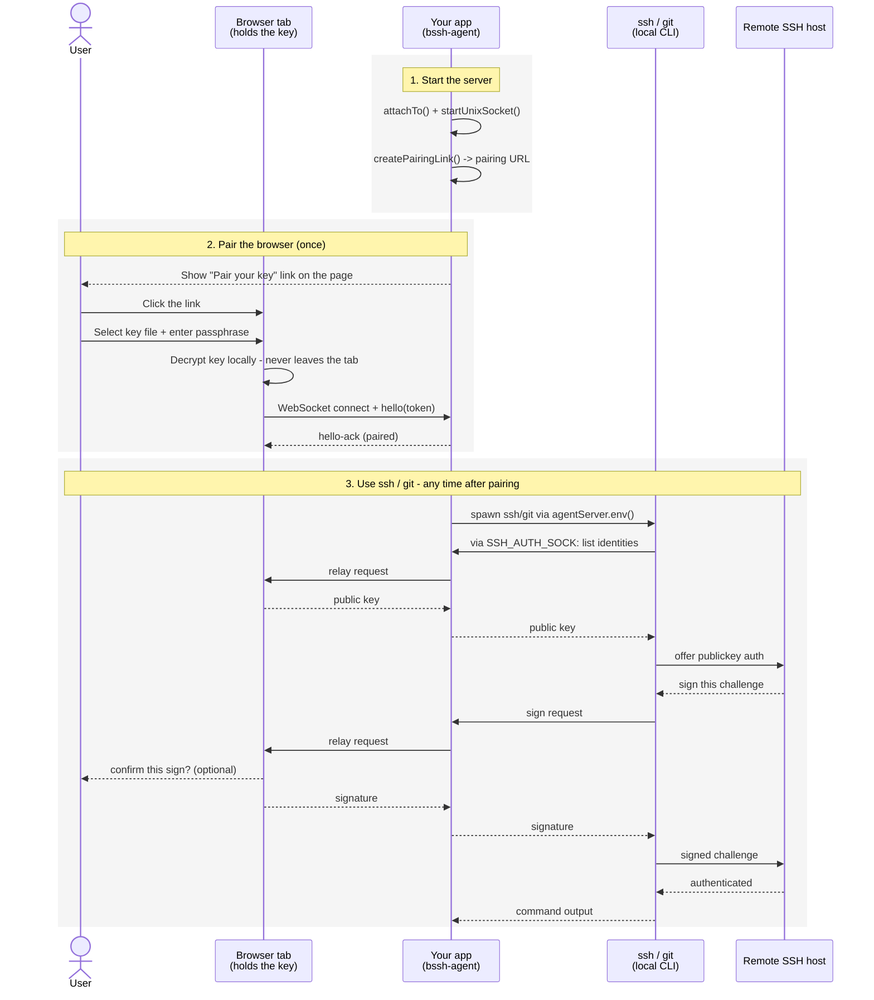

# browser-ssh-agent

[](https://github.com/so5/browser-ssh-agent/actions/workflows/ci.yml)
[](https://coveralls.io/github/so5/browser-ssh-agent?branch=main)
[](https://codeclimate.com/github/so5/browser-ssh-agent/maintainability)

*[日本語](./README.ja.md)*

SSH agent forwarding over WebSocket: the private key lives in a browser tab,
signing is relayed to a Node.js SSH client. A reimplementation of `ssh -A`
where the "agent" is a paired browser session instead of a local socket.

## How it works

Pairing (step 2 below) happens once; using `ssh`/`git` (step 3) then works
for as long as the browser tab stays connected, with no further setup.



## Status

The core of the library relays signing requests from a paired browser
session to a real `SSH_AUTH_SOCK` Unix domain socket
(`agentServer.startUnixSocket()`). Spread `agentServer.env()` into a
`child_process.spawn()` call, and that spawned `ssh`/`git`/`rsync`/`scp`
process authenticates using a key that only ever exists in the browser tab
— never on the server, never on disk.

Two more pieces build on top of that:

- **`bssh-agent` CLI** — a standalone daemon, `ssh-agent`-style, for the
  case `agentServer.env()` doesn't cover: a human typing `ssh`/`git`/`rsync`
  directly into their *own* interactive shell rather than a child process
  your Node app spawns. See [CLI: `SSH_AUTH_SOCK` for your terminal](#cli-ssh_auth_sock-for-your-terminal).
- **`<bssh-agent-pairing>` widget** (`bssh-agent/widget`) — a drop-in Web
  Component wrapping the browser-side primitives below, so a host page needs
  only a `<script>` tag and a custom element instead of hand-writing a key
  form and confirm-sign dialog. See [Browser, using the drop-in widget](#browser-using-the-drop-in-widget).

v1 supports Ed25519 keys only. RSA/ECDSA can be added by implementing the
`Signer` interface (`src/browser/signers/`) — no protocol change required.

There's also a lower-level way to integrate directly with `ssh2`'s own
`Client` API instead of spawning external CLI tools — see [Advanced](#advanced).

## Installation

```sh
npm install bssh-agent
```

This package is **ESM-only** (`import`, not `require()`). It publishes four
subpath exports:

- `bssh-agent/server` — the Node.js server-side API (`AgentServer`, ...).
- `bssh-agent/browser` — browser-side primitives (`loadKeyFromFile`, `connectAgent`, ...).
- `bssh-agent/widget` — the drop-in `<bssh-agent-pairing>` Web Component, built on top of `bssh-agent/browser`.
- `bssh-agent/shared` — protocol types shared by all three of the above.

It also installs a `bssh-agent` CLI binary — run it via `npx bssh-agent`, or
just `bssh-agent` once the package is installed.

See the [API reference](./docs/REFERENCE.md) for the exhaustive list of
every export, option, and event across all four subpaths.

## Usage

### Server

Attach to your app's existing HTTP(S) server and start the Unix socket
transport — this is the normal way to wire up `AgentServer`:

```ts
import { createServer } from 'node:http';
import { spawn } from 'node:child_process';
import { AgentServer } from 'bssh-agent/server';

const httpServer = createServer(/* your app's existing request handler */);
const agentServer = new AgentServer();

agentServer.attachTo(httpServer, '/ws');
await agentServer.startUnixSocket();

// Render this as a link/button on a page the user is already viewing in
// their own browser (e.g. `<a href={url}>Pair your SSH key</a>`) — no need
// to relay it through any other channel. Never log it persistently — the
// pairing token lives in the fragment on purpose.
const { url } = agentServer.createPairingLink('https://your-app.example/pair');

agentServer.on('session-paired', () => {
  spawn('git', ['clone', 'git@github.com:you/repo.git'], {
    env: { ...process.env, ...agentServer.env() },
    stdio: 'inherit',
  });
});

// Your app's own server startup — not part of this library. attachTo()
// only registers an 'upgrade' listener; it doesn't start listening itself.
httpServer.listen(8787);
```

The `/ws` path above matches `<bssh-agent-pairing>`'s zero-config default —
see the widget section below. `agentServer.listen(port)` is also available
as a standalone alternative to `attachTo()`; see the
[API reference](./docs/REFERENCE.md#bssh-agentserver).

### Browser

Served from the page `createPairingLink`'s `baseUrl` points at:

```ts
import { loadKeyFromFile, connectAgent } from 'bssh-agent/browser';

const token = new URLSearchParams(location.hash.slice(1)).get('token')!;
const key = await loadKeyFromFile(fileInput.files[0], passphraseInput.value);

const connection = connectAgent({
  wsUrl: 'wss://your-app.example:8787/ws',
  token,
  key,
  confirmSign: async ({ comment, fingerprint }) =>
    confirm(`Sign with ${comment} (${fingerprint})?`),
});
```

### Browser, using the drop-in widget

`<bssh-agent-pairing>` wraps `loadKeyFromText` + `connectAgent` above into a
single custom element with its own key-loading form and confirm-sign UI —
add a `<script>` tag and the tag itself, no hand-written form or dialog
required:

```html
<script type="module" src="https://unpkg.com/bssh-agent@0.1.0/dist/widget/index.js"></script>
<bssh-agent-pairing></bssh-agent-pairing>
```

Pin the version (as above) rather than floating on `@latest` — a breaking
change in a later release shouldn't silently change what a copy-pasted
`<script>` tag loads. Self-hosting `dist/widget/index.js` (e.g. from your
own app's static assets after `npm install`) works the same way and avoids
a runtime dependency on a third-party CDN.

By default it reads the pairing token from `location.hash` (matching
`createPairingLink()`'s output) and derives its WebSocket URL from
`${location.protocol}://${location.host}/ws` — matching the `attachTo(httpServer, '/ws')`
example above. Pass the `ws-url` attribute, or set the `token`/`wsUrl`
properties from JS, if your host page needs to supply them explicitly (e.g.
a different path, or embedded in an iframe).

It emits `status-change`, `paired`, `error`, `sign-request`, and
`key-forgotten` `CustomEvent`s so a host page can observe activity without
touching `bssh-agent/browser` directly:

```js
document.querySelector('bssh-agent-pairing').addEventListener('paired', () => {
  console.log('key paired and ready');
});
```

It zeroizes the *decrypted* key automatically on disconnect (and via its
built-in "Forget key" button) — see [Security notes](#security-notes) — so
the passphrase is always required again after a drop. What it does *not*
require again is the file: the widget keeps the still-*encrypted* key file
text cached in memory for the life of the page, so reconnecting after a
dropped WebSocket (network blip, laptop sleep, tab backgrounded — anything
short of actually closing the tab or reloading the page) shows a
passphrase-only form instead of the full file picker. A "Use a different
file" button is always available alongside it to discard the cache and go
back to picking a file, and the explicit "Forget key" button always clears
both the decrypted key *and* the cached file — there's no way to reconnect
without the passphrase, only ways to avoid re-selecting the file. Caching
the encrypted text costs nothing security-wise: it's exactly what the
passphrase already protects, and the passphrase itself is never cached.
Reconnecting still needs a fresh pairing token from your host app (tokens
are single-use, and there's no session resumption) — only the key-loading
step is skipped.

Set `auto-confirm="true"` to skip the built-in approve/deny prompt entirely
(logs a console warning when used — see security notes below), or set the
`confirmSign` property to supply your own UI instead of the built-in one.

See the [API reference](./docs/REFERENCE.md#bssh-agentwidget) for the full
attribute/property/event listing.

## CLI: `SSH_AUTH_SOCK` for your terminal

`agentServer.env()` only helps `child_process.spawn()` calls your own Node
process makes. It does nothing for a human typing `ssh`/`git`/`rsync`
directly into their own already-running shell — Unix has no way to inject an
env var into a sibling process after the fact. The `bssh-agent` CLI solves
this the same way real `ssh-agent` does:

```sh
eval "$(bssh-agent)"
```

This starts a background daemon, prints a pairing URL to stderr (and tries to
open it in your default browser, unless `--no-browser` or a remote/SSH
session is detected), and `eval`s `SSH_AUTH_SOCK`/`SSH_AGENT_PID` into your
current shell. Once you've paired a key via the opened page (using the
`<bssh-agent-pairing>` widget above), every subsequent `ssh`/`git`/`rsync` in
that shell picks up `SSH_AUTH_SOCK` for free — no code changes in any host
app required. If a command runs before you finish pairing, it just fails
auth cleanly and can be retried, the same way it would against a locked
GUI keychain agent.

```sh
bssh-agent -k    # stop the daemon and unset the env vars: eval "$(bssh-agent -k)"
```

See the [API reference](./docs/REFERENCE.md#bssh-agent-cli) for the full
flag listing (`-D`/`--foreground`, `--name`, `--force`, `--port`,
`--runtime-dir`, ...).

Unlike real `ssh-agent`, `bssh-agent -k` must be able to find a running
daemon from a *different* shell session than the one that started it, so it
keeps a small state file (pid, socket path, port) under its runtime
directory rather than relying solely on `SSH_AGENT_PID`.

## Advanced

### Using `agentServer.agent()` directly with `ssh2.Client`

For apps that make SSH connections themselves through `ssh2`'s own `Client`
API (`exec`/`sftp`/`forwardOut`, agent-forwarded hops to further remote
hosts) instead of spawning external `ssh`/`git`/`rsync` CLI processes,
`agentServer.agent()` returns a `ssh2`-compatible `BaseAgent` you can pass
directly:

```ts
agent: agentServer.agent(),
agentForward: true, // forwards further if the target host hops onward
```

This integration path is real and tested (`agentServer.agent()` has been
usable since the project's earliest version), but isn't written up here in
full yet — see `src/server/transports/inProcessAgent.ts` and the
[API reference](./docs/REFERENCE.md#bssh-agentserver) in the meantime.

### Delivering the pairing link across devices (QR code, printed link, ...)

The [Server usage example](#server) assumes the simplest and safest case:
the process minting the pairing link *is* the web app the user is already
viewing in their own browser, so `createPairingLink()`'s URL can just be
rendered as a link/button on that page — no separate delivery channel
needed at all.

That assumption breaks down when whatever calls `createPairingLink()` has
no browser of its own to render a link in — most notably the `bssh-agent`
CLI (see [CLI](#cli-ssh_auth_sock-for-your-terminal)), which may be running
on a remote/headless machine you've SSH'd into. In that case the URL has to
reach a *different* device's browser somehow: printing it for the user to
copy-paste, or rendering it as a QR code for a phone to scan, are the two
common approaches.

Both introduce a risk the `<a href>` case doesn't have: the URL — with its
live, single-use token — now exists as something that can be captured and
retained: a QR code image saved to a file, a printed page filed away, a
terminal session that gets logged. That's the same risk class as [never
logging the pairing link persistently](#security-notes) — a saved QR code
image *is* a persistent log of the token. The token's short default TTL (5
minutes) bounds how long such exposure actually matters, but don't rely on
that alone — treat any QR code or printed copy as something to discard once
the pairing attempt is done, the same way you'd treat a password written on
a sticky note.

### Unattended access (no human present)

`bssh-agent` requires a human to keep a browser tab open for every signing
operation (see [How it works](#how-it-works)) — it isn't a fit for
automation that must authenticate with nobody present. Two established
alternatives apply instead, depending on what you control:

- **SSH certificates** (`TrustedUserCAKeys`) — requires control over the
  *remote host's* `sshd` configuration, i.e. administering that host, not
  just holding a user account on it.
- **A dedicated keypair for the app server** — works with an ordinary user
  account on the remote host, no root required. See the
  [dedicated-key bootstrap guide](./docs/DEDICATED_KEY_BOOTSTRAP.md) for the
  exact commands and `authorized_keys` restrictions to use.

## Known issues

**Upstream `ssh2` bug worked around:** `ssh2`'s `AgentProtocol` (server
mode) mishandles the `SSH_AGENTC_EXTENSION` probe modern OpenSSH clients
(8.9+) send before listing identities — it replies correctly but fails to
skip the message's payload, desyncing the wire framing for everything after
and silently wedging the whole agent connection. `UnixSocketAgent` filters
and answers these probes itself before handing other messages to
`AgentProtocol`; see the comment above `pipeFilteringUnsupportedRequests` in
`src/server/transports/unixSocketAgent.ts` for details. Confirmed present
through `ssh2@1.17.0` (latest as of writing).

## Security notes

- **Key material lives in the browser tab's JS heap** for the session. This
  is the fundamental trade-off of the design (avoiding the server holding the
  key) and is not fully eliminable — mitigate with a minimal, dependency-light
  pairing page, a strict CSP (`script-src 'self'`, no inline/eval), a
  dedicated tab rather than an iframe, and call `KeyHandle.zeroize()` on
  disconnect/idle.
- **Use `wss://` off-loopback.** Plain `ws://` is only acceptable to
  `127.0.0.1`.
- **`confirmSign` should be supplied and default to requiring approval** —
  without it, anything relaying through the paired server can silently
  authenticate as the user. Note the agent protocol never reveals *which
  remote host* a challenge is for, only the key fingerprint.
- **Pairing tokens are single-use and go in the URL fragment**, never a query
  parameter (proxies commonly log those) and never a persistent log file.
- **The Unix socket file is a local privilege boundary**: anything on the
  machine that can connect to it gets full "sign arbitrary challenges with
  the loaded key" power, equivalent in trust to real agent forwarding. It's
  created at a per-run unguessable path with `0600` permissions. No Windows
  named-pipe support — Unix domain socket only.
- **The CLI's self-served pairing page binds `127.0.0.1` only**, never
  `0.0.0.0`, by default. Using it over SSH into a remote box requires you to
  `ssh -L` the pairing port yourself — the CLI skips auto-opening a browser
  when `SSH_CONNECTION`/`SSH_TTY` suggest a remote/headless session.
- **The widget's `auto-confirm="true"` attribute is a documented, dangerous
  escape hatch** (it logs a console warning when used): it approves every
  sign request with no prompt at all, equivalent to running without
  `confirmSign`. Only use it where the host page implements its own
  equivalent safeguard.
- **The widget caches the encrypted key file's text in memory across a
  disconnect**, so reconnecting only asks for the passphrase, not the file —
  see [Browser, using the drop-in widget](#browser-using-the-drop-in-widget).
  This is a deliberate, low-risk convenience: the cached text is exactly
  what the passphrase already protects, so caching it doesn't expose
  anything the passphrase-check doesn't already guard, and it's discarded
  entirely by "Forget key," "Use a different file," or a page reload. It is
  *not* the same as caching the decrypted key or the passphrase — those are
  never retained past a disconnect. If your threat model requires that even
  the encrypted file be forgotten immediately on disconnect, don't rely on
  the widget's default behavior here; this is the "least security-risk"
  convenience option, not a no-op.

## Reference

See [docs/REFERENCE.md](./docs/REFERENCE.md) for the exhaustive API
reference — every export across all four subpaths, plus the full CLI flag
listing — as opposed to this README's narrative getting-started coverage.

## Development

```sh
npm install
npm run typecheck
npm test
npm run build
npm run test:cli   # builds, then exercises the real bssh-agent binary end-to-end
```
